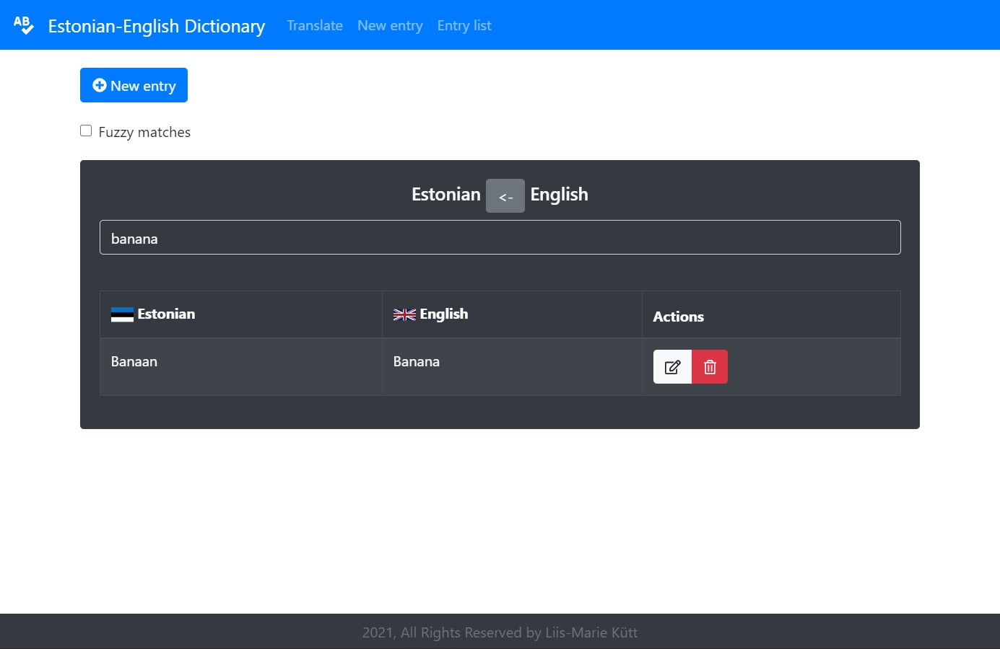
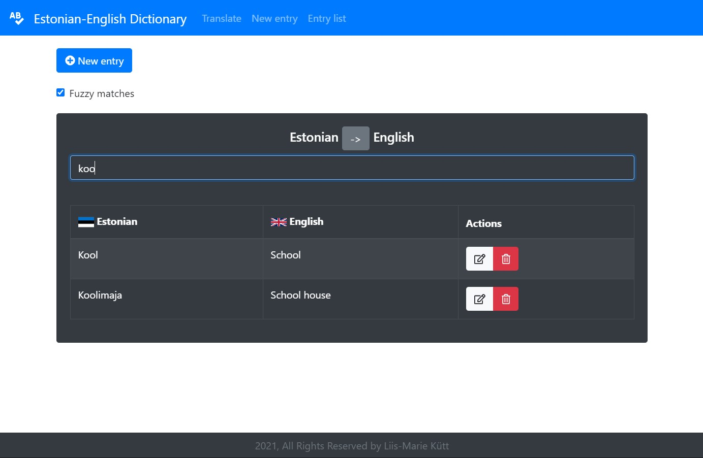
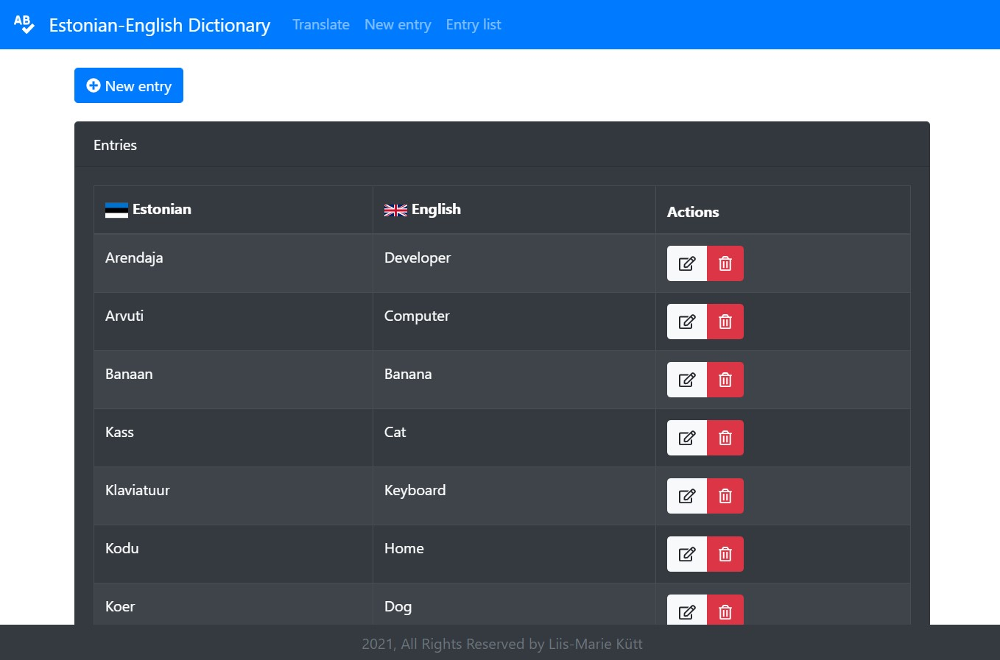
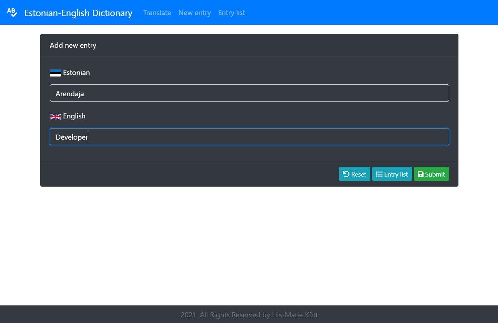

# Estonian-English dictionary

### Web application for an Estonian-English dictionary.

User can add, modify and delete Estonian/English words and their equivalents. One word can have several equivalents.

User can search dictionary entries, finds exact and fuzzy matches.

Application uses **Javascript** and **Java**. For UI layer **React** has been used and for API layer **Spring-boot**.
  
## Local setup guide

Clone the repository
  
### Starting API layer
Navigate to src/main/java/com.likutt.dictionary and run **DictionaryApplication.java** from there.
  
### Starting UI layer

Open terminal and navigate to UI project directory.
#### `cd src/main/webapp/client`

Before running the application for first time.
#### `npm install`

Running the application
#### `npm start`
  
## Screenshots

Search 'banana' (English -> Estonian) |
------------ |
 |

Search 'koo' with fuzzy enabled (Estonian -> English) |
------------ |
 |

Entry list |
------------ |
 |

Add new entry |
------------ |
 |
